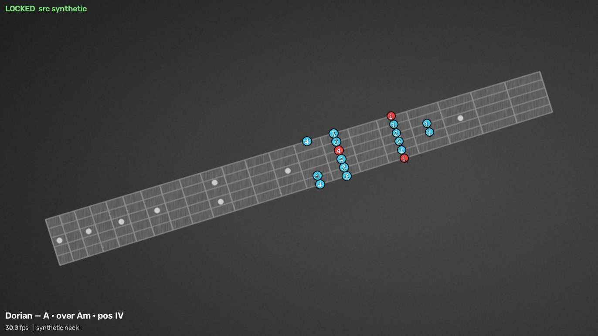
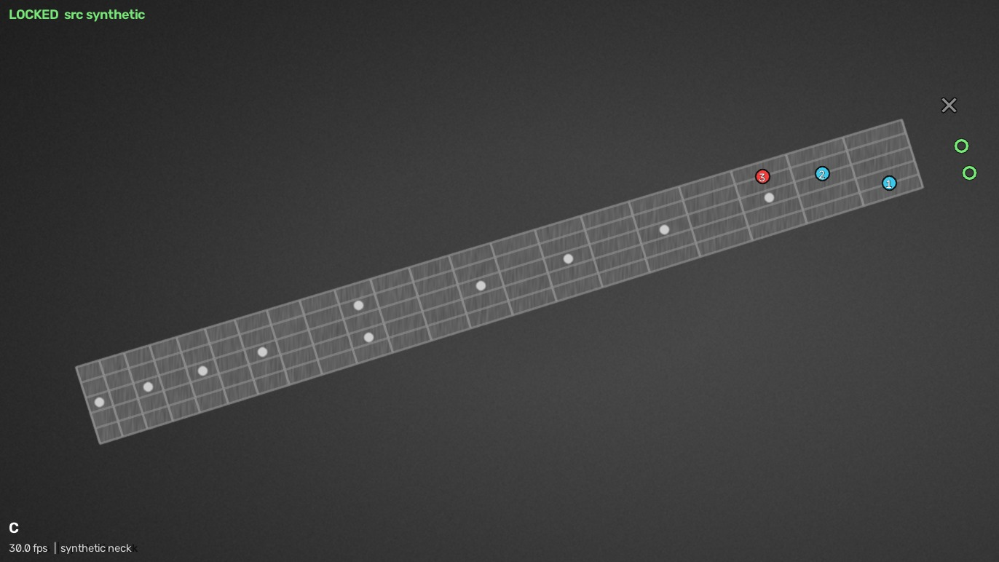
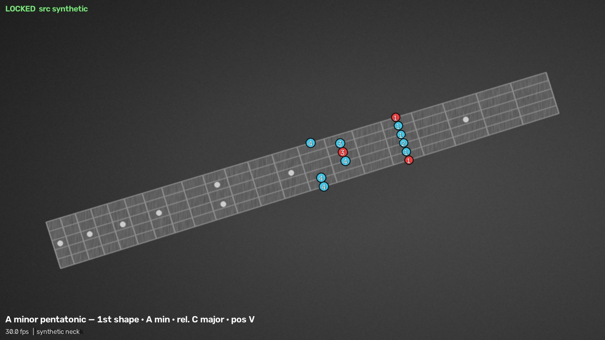
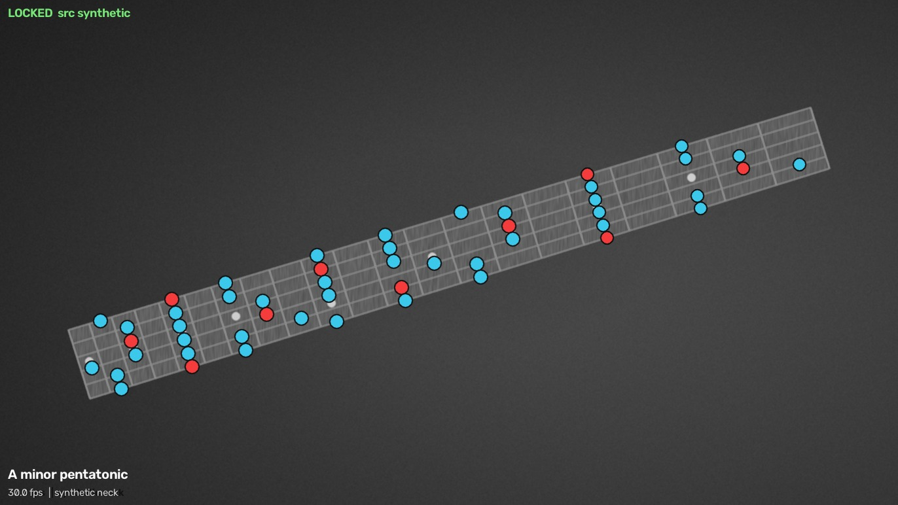
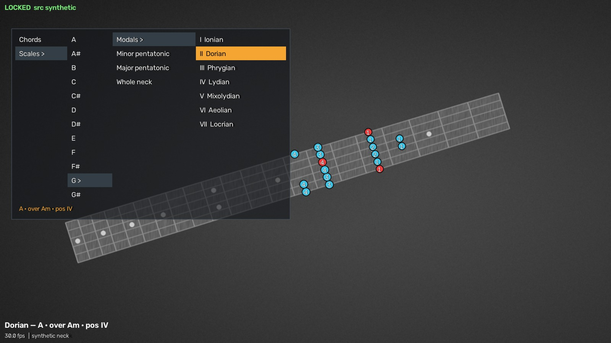
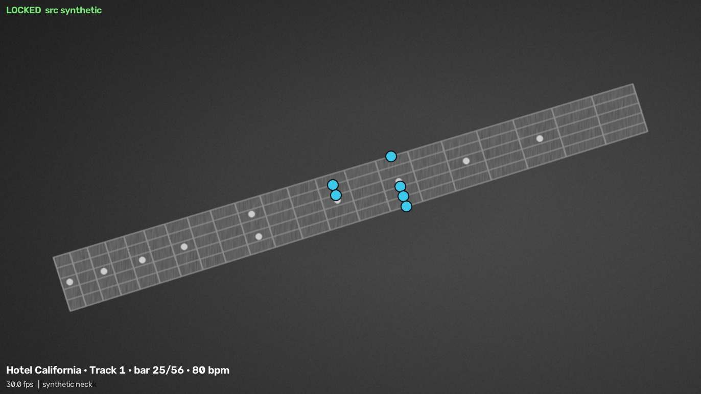
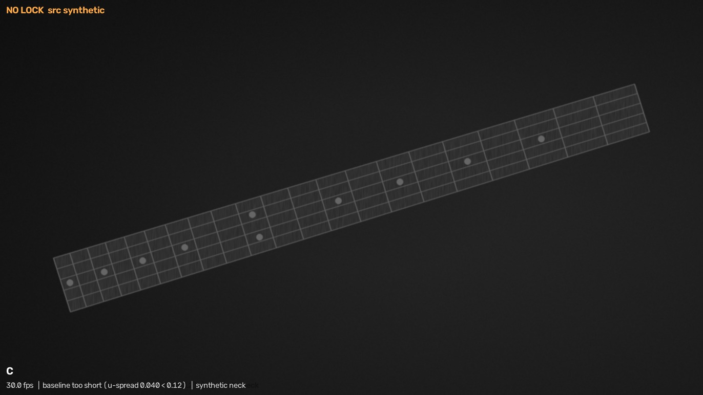

<h1 align="center">FretGuide</h1>

<p align="center">
  <b>Point a camera at your guitar. Pick a chord.<br>
  The dots appear on the real fretboard, on the live video, and stay there while you play.</b>
</p>

<p align="center">
  
  
  
  
  
</p>

<p align="center">
  
</p>

<p align="center"><sub><i><b>Dorian, the second mode of G — so its root is A and it belongs over Am,</b> at the fourth fret.<br>
Red is the root, blue the rest of the scale, the number is the finger. <a href="#modes-done-properly">Why it is named that way →</a></i></sub></p>

---

Nothing is attached to the instrument — no markers, no stickers, no reference photo, no
calibration taps. A trained keypoint model finds the fretboard in every frame from its own
pixels, so you can move the guitar, put it down and pick it up again. **There is no lock to
lose.**

Runs entirely on a laptop. No network calls, no accounts, no cloud, no telemetry. Inference
is on the Intel Arc iGPU via OpenVINO.

---

## Two ways in

### 🎸 On your actual guitar

The point of the project. A camera watches your instrument and the overlay is composited
onto the live video — the dots sit on *your* frets, under *your* fingers, and follow the
neck as you move it.

```bash
.venv/bin/python tools/run_app.py -d 4
```

This is the real product, and it comes with a real caveat: **it needs a model trained on
your guitar, in your room.** Ours works — see [Where the model actually
is](#where-the-model-actually-is) for what that honestly means. But anyone else wanting to
try it would have to capture and label their own frames first, which is not a thing you can
ask of someone who just wants to learn a scale.

### 💻 On the virtual neck — no camera, no model, nothing to train

So there is a second way in, and it is not a demo mode. It is **the whole app** — chords,
scales, modes, the menu, songs, the trust gate — driven by a fretboard drawn from a known
matrix instead of a camera.

```bash
.venv/bin/python tools/run_app.py          # that is the entire setup
```

No hardware, no dataset, no training, no accounts. A full 21-fret Stratocaster neck you can
practise hand and finger placement against immediately. And because the pose is **exact by
construction**, a dot in the wrong place here is the renderer's fault and nothing else's —
which is why it is also what the entire overlay is developed and tested against.

> Every screenshot in this README is rendered from that virtual neck by
> [`tools/screenshots.py`](tools/screenshots.py), on any machine, with no hardware at all.

---

## What it teaches

<table>
<tr>
<td width="50%"></td>
<td width="50%"></td>
</tr>
<tr>
<td><b>Chords.</b> Muted strings get a cross, open strings a ring, fretted notes a numbered finger.</td>
<td><b>Pentatonics.</b> Five shapes, minor and major, in any key — one position at a time.</td>
</tr>
<tr>
<td></td>
<td></td>
</tr>
<tr>
<td><b>Whole-neck maps</b>, for when you want the territory rather than one box.</td>
<td><b>The catalogue</b>, browsed as columns. The neck updates as you scroll — nothing to confirm.</td>
</tr>
</table>

### Modes, done properly

Most software shows modes as seven scales and quietly teaches you nothing, because **every
mode of a key is the same set of notes.** G ionian, A dorian, B phrygian, C lydian, D
mixolydian, E aeolian and F♯ locrian are one scale; across the whole neck all seven light up
*identically*. Presented that way they are unlearnable, because on those terms nothing
distinguishes them.

What distinguishes them is three things, and FretGuide shows all three:

| | Ionian | Dorian | Phrygian | Lydian | Mixolydian | Aeolian | Locrian |
|---|---|---|---|---|---|---|---|
| **root** | G | A | B | C | D | E | F♯ |
| **over the chord** | G | Am | Bm | C | D7 | Em | F♯m♭5 |
| **position** | II | IV | VII | VII | IX | XI | II |

This is also why a mode here is addressed by its **parent key and degree** rather than by its
own root. "Dorian in the key of G" and "A dorian" name the same seven notes, but only the
first tells you which six other modes it shares them with — and that shared set is the whole
point. Every screen shows both: the key you chose, and the root that degree lands on.

All seven box shapes are **transcribed from a teaching sheet**, never computed — four span
four frets and use one hand position, three span five and the hand shifts between strings,
which no offset formula expresses. They are then cross-checked three ways: every note belongs
to the key, every box starts on its own root, and the fret each box begins at reproduces the
sheet's own roman numerals without that number being stored anywhere.

---

## 🎵 Play a song

The newest feature. Drop in a Guitar Pro file and watch the part play on the neck, at
whatever speed you can actually manage.

<p align="center">
  
</p>

```bash
.venv/bin/pip install -e ".[score,audio]"
.venv/bin/python tools/run_app.py --max-fret 21 --song hotel-california.gp3 --audio
```

Files come from anywhere that has them — **[gprotab.net](https://gprotab.net/)** is a
community archive of 50,000-odd Guitar Pro tabs, free and without an account. They are
community transcriptions, so quality varies and the fingering you get is whoever's typed it
in; `--refinger` below exists partly for that.

| Key | |
|---|---|
| `p` | play / pause |
| `[` `]` | back / forward one bar |
| `-` `=` | slower / faster, 0.25×–2× — **without changing the pitch** |
| `0` | back to the start |

**It makes sound, too.** The part is synthesised with a Karplus–Strong plucked string — a
physical model, so no soundfont and no sample library — and every pitch from E2 to E6 lands
within **1.6 cents**, measured off the waveform by FFT rather than trusted from the
arithmetic that produced it. When audio plays it becomes the **master clock**: the play head
follows the sound card, not the video frames, because those two drift and a dot that
disagrees with what you hear is worse than a silent one.

Three things the format forced, each a small correctness story:

- **Ties are not notes.** A tied note is a finger that never left the string, so it extends
  the note it continues instead of drawing a second instruction to do nothing.
- **Page order is not playback order.** Repeats are unrolled and alternate endings picked by
  pass number, or the neck drifts out of sync with the recording.
- **Camera reach is reported, not hidden.** The model poses to fret 12, so a part written
  above it cannot be drawn there — the app says which tracks fit rather than silently drawing
  nothing.

### Re-fingering, which is the interesting part

A MusicXML or MIDI file gives you *pitches*, not places — E4 sounds at five different spots
on a neck. So there is a solver: a shortest path over hand positions, because the cheapest
place for one note is routinely a terrible place given where the hand was a beat ago.

It is measured against **8284 notes of human transcription** — throw a Guitar Pro file's
fingering away, hand the solver the bare pitches, and compare:

| | agreement with the transcriber |
|---|---|
| every note at its nearest spot | 64.7% |
| first cost model | 62.9% — *worse than doing nothing* |
| **tuned** | **71.8%** |

The residual is mostly a *second good answer*, not a wrong one. And it earns its keep: Sweet
Home Alabama's solo is written up to fret 17 and cannot be drawn on a camera neck at all —
re-solved for twelve frets, **268 of its 297 notes come back**.

---

## Where the model actually is

Honest answer: **it works, with a known weakness.**

The trained net finds the fretboard from scratch in every frame, and the overlay tracks the
instrument as it moves. What it does not do perfectly is hold accuracy at **fret positions
where the fretting hand overlaps the neck.** An occluded fret produces a weak or empty
heatmap channel, and while the fit is designed to survive exactly that — 26 points fitted to
8 unknowns, so a missing one drops out rather than corrupting — the frets nearest a covering
hand can still drift.

That is the next training problem, and it is a *data* problem rather than an architecture
one: more frames captured with the hand in playing position.

### What it predicts

**26 keypoints** — both ends of all 13 fret wires, nut through fret 12 — as one heatmap
channel each, at stride 2 on a 640×384 greyscale input. A robust homography is fitted to
whichever keypoints came back confident, and the fret law fills in everything between them.

Two keypoints per fret rather than four board corners, because corners measured **worst**:
they force the fret law to be extrapolated from the extremes, and a tight cluster of inliers
yields a *confident-looking* homography that is badly wrong. That was v1's fatal bug,
measured at **1.37 fret-widths** of error.

Fitting 26 points to 8 unknowns is deliberate over-determination — independent per-point
error averages down instead of landing on the drawn dots.

### How it was trained

<table>
<tr><td width="26%"><b>Capture</b></td><td>Video of a real Stratocaster in a real room. Phone camera over USB into a v4l2 loopback device, 1920×1080 at 30 fps.</td></tr>
<tr><td><b>Label</b></td><td><b>384 frames, hand-clicked</b> — four board corners each. <code>dataset/labels.json</code> is the one irreplaceable artefact in this repository: the frames are gitignored and regenerable, the clicks are not.</td></tr>
<tr><td><b>Encode</b></td><td>A label <i>is</i> a homography, so an augmented label is exactly <code>A @ H</code> — pixels and points cannot drift apart. Keypoints become Gaussian heatmaps, and a test bounds what <i>any</i> amount of training could achieve at the current input size, stride and sigma.</td></tr>
<tr><td><b>Train</b></td><td>FretNet, a small keypoint U-Net. 200 epochs on an RTX 4060, batch 16, four augmented views per frame. Best checkpoint selected on the <i>augmented</i> score, never the still one — choosing on <code>still</code> picks the most over-fitted epoch.</td></tr>
<tr><td><b>Export</b></td><td>ONNX → OpenVINO, benchmarked on the machine that actually runs the app, so inference lands on the Intel Arc iGPU rather than the CPU.</td></tr>
</table>

### The failure that shaped everything

Run 1 scored **0.009 fret-widths on training frames and 4.4 on held-out ones.** The model had
learned to output the average board position and ignore the image entirely.

The dataset is why. 384 frames sounds like plenty; they cover almost one pose — board angle
spans 17°, and within a capture session the board centre moves **13 px**. It is effectively
nailed in place, and the room around it is a perfect shortcut.

The original design error was assuming augmentation would prevent this. **It cannot.**
Warping the whole image moves the room and the guitar *together*, so the board's position
relative to the window and the shelves survives every rotation, scale and perspective change.
The shortcut is preserved by construction.

Four fixes, and they are why the model works now:

1. **Bound the receptive field below the distance to the nearest room cue.**
   `FretNet(depth=3)` sees 83 px; the neck is 35 px wide, the room is 150–400 px away. The net
   *cannot see the furniture*.
2. **Heavy geometric augmentation** — ±35° rotation, 0.6–1.55× scale, the board placed
   anywhere in the frame, perspective jitter, motion blur, and elliptical occluders standing in
   for the fretting hand.
3. **Background compositing.** A quarter of samples have the neck cut out along a perspective
   quad and composited onto a different frame's background. Two subtleties learned painfully:
   the donor frame's own neck must be blurred out first, or the image contains two fretboards
   and a label naming one — which trains the net to answer *"not a fretboard"* on real
   fretboards. And decoy islands of original content are pasted elsewhere, because cutting
   along the board quad otherwise draws a seam **exactly around the answer**.
4. **Split by capture order, never randomly.** 211 of 284 consecutive frame pairs are
   near-identical; a random split would put a twin of nearly every validation frame into
   training and report a fantasy score.

A dedicated diagnostic prints every epoch: distance from the predicted board centre to the
**true** board, versus to the **training-average** board. If the average is closer, the line
reads `<-- LEARNING THE ROOM`. Loss tells you something is wrong; that tells you *what*.

---

## The engineering that matters

### One number, and it is not pixels

Everything is measured in **fret-widths** — never pixels, never heatmap loss — because it is
the only unit that answers the actual question: *did the dot land in the right fret?* The
budget is **±0.25**, and it is accounted for rather than hoped for:

| source | cost (fret-widths) |
|---|---|
| label noise, p90 | 0.035 |
| encode → decode → pose ceiling, p95 | 0.014 |
| **left for model error** | **~0.20** |

The ceiling row is enforced in CI by a test that bounds what *any* amount of training could
achieve given the current input size, stride and sigma.

### Refusing to draw beats drawing nonsense



Before anything is rendered, a pose must clear the trust gate: **at least 8 keypoints**
surviving the confidence filter **and** spanning **at least 12% of the neck's length**.

The spread half is the load-bearing one. Inlier count alone does not catch a *cluster* — a
tight group of points can be entirely inliers and still leave the pose under-determined along
the neck. That exact failure cost v1 1.37 fret-widths.

When the gate fails the frame dims and the HUD says `NO LOCK` with the reason that failed.
**That is correct output, not a bug.**

<br clear="right">

### Fret spacing is not linear

`u(n) = 1 − 2^(−n/12)`, and a dot for fret *f* sits at `(u(f−1) + u(f)) / 2`. In normalised
coordinates the scale length **cancels**, which is why the template is exact for any
equal-tempered guitar without measuring the instrument. Never interpolate between frets
linearly — every geometric bug in this project has been a violation of that rule or of the
string numbering.

---

## 🥽 Where this goes next

The overlay problem and the mixed-reality problem are the same problem wearing different
hardware. FretGuide already recovers a full planar pose of a fretboard from a single camera,
at frame rate, on an integrated GPU — which is precisely what a headset needs.

**Meta Quest passthrough** is the obvious next milestone: the same keypoint model and the
same fret law, rendering into a stereo pair instead of onto a video window, with the dots
locked to the instrument in your hands and your eyes free to look wherever they like. No
screen to glance at, which is the last real piece of friction in the current design.

That is a genuinely separate build — different runtime, different renderer, and an on-device
inference budget to measure from scratch. But nothing in the current architecture forecloses
it: the tracker hands over a homography, and what consumes it is already swappable.

Nearer term, in order:

| | |
|---|---|
| **Native shell** | A PySide6/OpenGL front end replacing the OpenCV window. Video path **done** — colour 1080p at **1.2 ms/frame**, 28× the headroom needed for 30 fps. The overlay port is next. See [`docs/PLAN-shell.md`](docs/PLAN-shell.md). |
| **Hand-occlusion training** | More labelled frames with the fretting hand in playing position — the known weakness above. |
| **Audio note-verification** | Fully researched ([`05-audio-stack.md`](docs/research/05-audio-stack.md)) and deliberately parked. Hears what you play and tells you whether it matched. Vision arbitrates *which string*, audio *which pitch*. |
| **MusicXML / MIDI import** | The fingering solver exists precisely so these can be read; only the file readers are missing. |

---

## Run it

```bash
python3 -m venv .venv
.venv/bin/pip install -e ".[dev]"

.venv/bin/python tools/run_app.py                 # virtual neck — no hardware at all
.venv/bin/python tools/run_app.py -d 4            # your camera
```

Optional extras: `[score]` to read Guitar Pro files, `[audio]` to hear them, `[gui]` for the
native shell, `[train]` to train a model. Full setup, every hotkey and the manual checks live
in **[QUICKSTART.md](QUICKSTART.md)**.

## Tests

```bash
.venv/bin/python -m pytest tests/ -q      # 466 tests, ~8 s, no hardware
```

466 tests on a fresh clone. A 467th measures label noise against the real captured
frames, which are gitignored and regenerable, so it skips unless you have them — the
only skip in the suite, and it reports itself.

They cover what *can* be proven without a guitar: synthetic-homography round-trips, the fret
law, note identities, the heatmap codec's accuracy ceiling, the trust gate's refusal
conditions, the fingering solver's exact constraints, and every pitch the synthesiser makes.

They also cover **where the overlay draws**, which is unusual for a computer-vision app. The
synthetic source hands back the matrix it drew from, so the pose is exact and every dot can be
checked against where the geometry says it belongs — by reading the rendered *pixels*, not the
drawing code's own arithmetic.

They deliberately do **not** cover whether a dot lands on your actual fret. That needs a
camera and an instrument, and it is judged by eye.

## Layout

| Path | What |
|---|---|
| [`fretguide/geometry.py`](fretguide/geometry.py) | Fret law, homography, `solve_is_trustworthy` — the trust gate |
| [`fretguide/theory.py`](fretguide/theory.py) | Note maths, scales, chords, neck-wide generation |
| [`fretguide/content.py`](fretguide/content.py) | Curated voicings and scale boxes |
| [`fretguide/modes.py`](fretguide/modes.py) | Modes as degrees of a key, and the pentatonic positions carved out of them |
| [`fretguide/score.py`](fretguide/score.py) | A song as timed fretboard positions — Guitar Pro in, `(string, fret, when)` out |
| [`fretguide/fingering.py`](fretguide/fingering.py) | Where to play a note — the shortest-path solver between pitches and the fretboard |
| [`fretguide/transport.py`](fretguide/transport.py) | The play head over a song — resolves to the same thing a chord does |
| [`fretguide/synth.py`](fretguide/synth.py) | Karplus–Strong plucked string — the sound of a part, as pure numpy |
| [`fretguide/audio.py`](fretguide/audio.py) | The output device, and the clock everything else follows |
| [`fretguide/menu.py`](fretguide/menu.py) | The practice catalogue as a browsable tree — pure state, no toolkit, shared by both apps |
| [`fretguide/source.py`](fretguide/source.py) | Frame sources: live camera, dataset replay, or the virtual neck needing no hardware |
| [`fretguide/capture.py`](fretguide/capture.py) | V4L2 capture, raw-YUV path |
| [`fretguide/dataset.py`](fretguide/dataset.py) | Labels → homographies, augmentation, heatmap codec |
| [`fretguide/model.py`](fretguide/model.py) | FretNet, the keypoint U-Net (torch, training only) |
| [`fretguide/predict.py`](fretguide/predict.py) | Live OpenVINO inference, pose fit, smoothing |
| [`fretguide/render.py`](fretguide/render.py) | The overlay |
| [`fretguide/shell/`](fretguide/shell/) | The native shell — YUV planes as GL textures, converted in a shader |
| [`fretguide/tracker.py`](fretguide/tracker.py) | Legacy enrollment/SIFT backend, kept as a baseline |
| [`tools/`](tools/) | `run_app`, `collect`, `train`, `export`, `screenshots`, `eval_fingering`, … |
| [`tests/`](tests/) | 466 tests. No camera, no GPU, no guitar required. |

## Documentation

| Doc | What it answers |
|---|---|
| [`QUICKSTART.md`](QUICKSTART.md) | How do I run it, and what do I do when tracking is poor? |
| [`docs/PRD-v2.md`](docs/PRD-v2.md) | What are we building, and how will we know it works? |
| [`docs/TRAINING.md`](docs/TRAINING.md) | How do I capture, label, train and export a model? |
| [`docs/PLAN-shell.md`](docs/PLAN-shell.md) | What replaces the OpenCV window, and in what order? |
| [`docs/research/`](docs/research/) | Why this stack, this approach, this budget. Ten documents; start with [`10-recommended-stack.md`](docs/research/10-recommended-stack.md). |
| [`docs/archive/v1/`](docs/archive/v1/) | What the first attempt was and why it was abandoned. |
| [`CLAUDE.md`](CLAUDE.md) | The contract for AI agents working in this repo. |

---

<p align="center"><sub>
Single user, one guitar, one room, offline. Every design decision is allowed to exploit that.
</sub></p>
