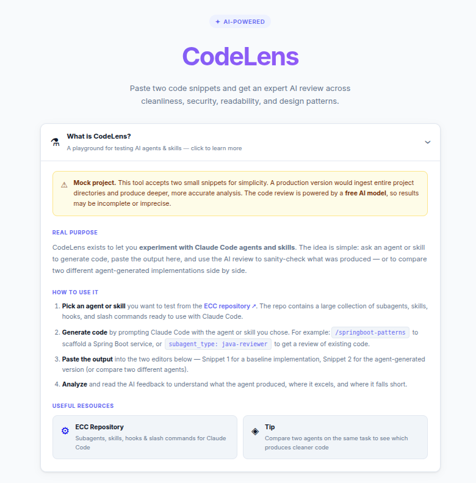
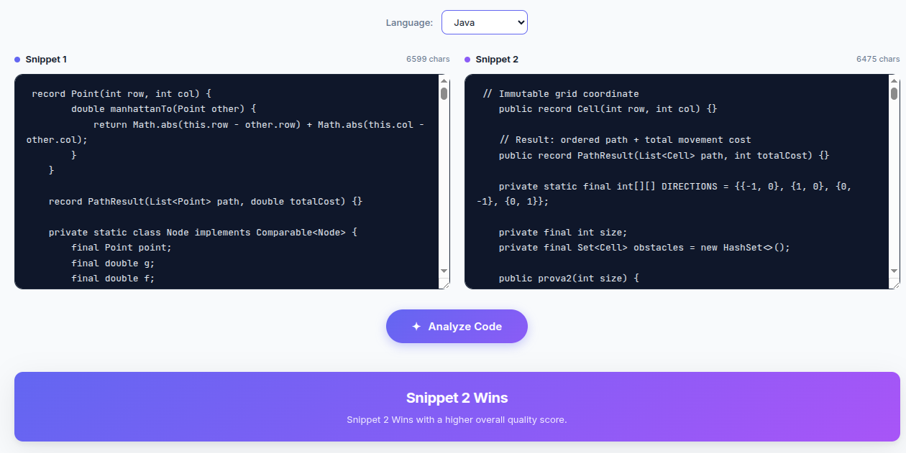
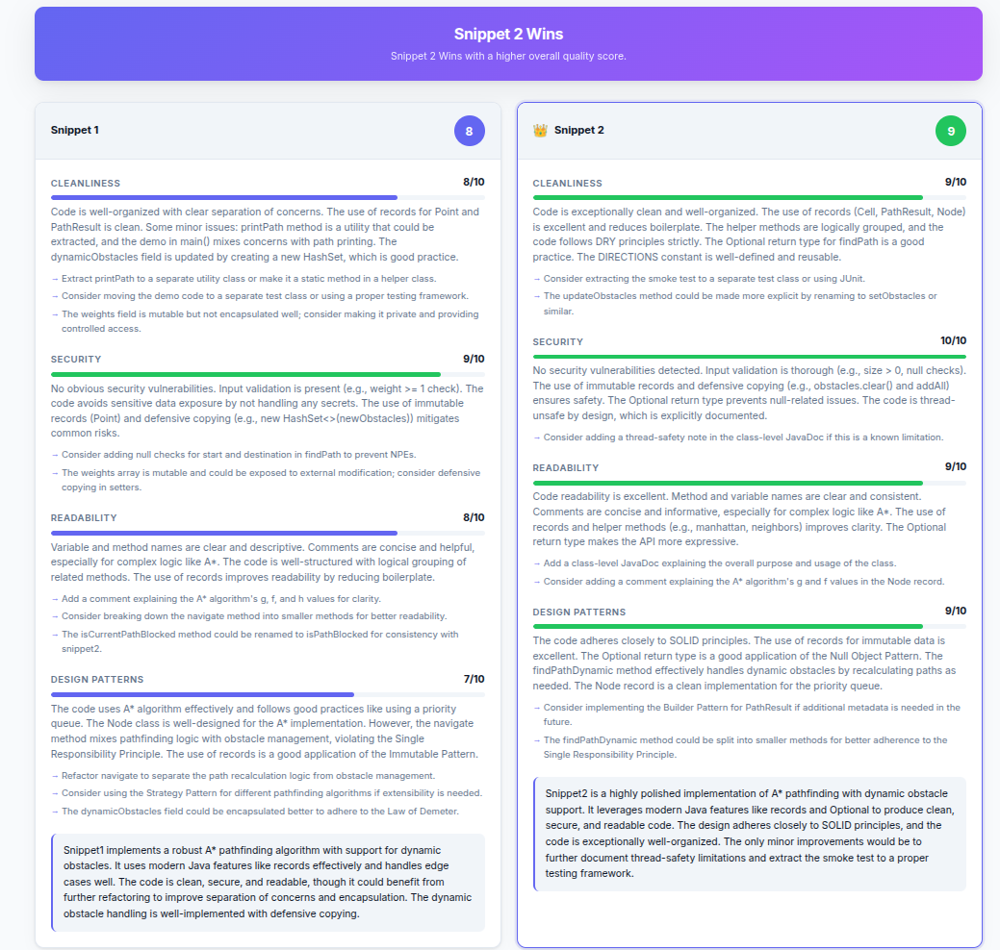
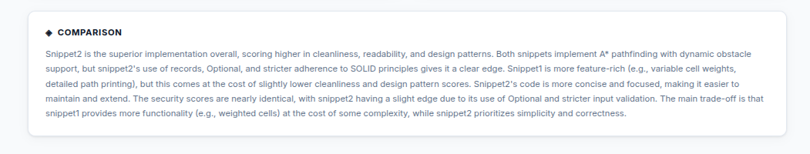

# CodeLens — AI Code Reviewer

A platform for testing different Claude Code **skills and agents** and evaluating the quality of the code they produce. The workflow is:

1. **Generate code** using different combinations of skills (e.g. `/java-coding-standards`, `/springboot-patterns`) and agents (e.g. `java-reviewer`, `security-reviewer`)
2. **Submit the outputs** as two competing snippets to the built-in AI reviewer
3. **Compare the results** — scores, observations, and a winner verdict across cleanliness, security, readability, and design patterns

This lets you measure concretely how much skills and agents improve code quality versus a plain prompt.


---
## Example — Skills & Agents vs. plain prompt

### A* Pathfinder — Dynamic Obstacle Grid

The same implementation task was submitted twice to Claude Code with identical requirements:

> *"Implement an A* pathfinding algorithm on a weighted 2D grid with dynamic obstacles, Manhattan heuristic, real-time recalculation, path + cost return."*

**Attempt 1 — plain prompt (no skills, no agents)**

**Attempt 2 — with `/java-coding-standards` skill + `java-reviewer` agent**


The skill enforced Java 21 conventions upfront (records, immutability, `Optional`, naming). After generation, the `java-reviewer` agent audited the output and flagged:

| Severity | Issue | Fixed |
|---|---|---|
| MAJOR | `findPathDynamic` could return a blocked path from a prior snapshot | Post-loop validity guard added |
| MAJOR | Mutable shared obstacle state undocumented for concurrency | Not-thread-safe notice added |
| MINOR | Redundant `g` field in `Node` record | Removed |
| MINOR | No null-check on snapshot list entries | `Objects.requireNonNull` added |




**The analyzer scored Attempt 2 higher** on correctness, safety, and maintainability. The skill loaded the right standards before generation; the agent caught the contract bugs that a plain prompt missed entirely.



Compare the results of the two attempts:

## Architecture

```
codelens/
├── backend/    # Spring Boot 4.1 + Java 21 REST API
└── frontend/   # React 19 + Vite SPA
```

- **Frontend** → `http://localhost:5173`
- **Backend**  → `http://localhost:8080`
- **AI**       → Mistral API (`mistral-small-latest`)

---

## Prerequisites

| Tool | Version |
|------|---------|
| Java | 21+ |
| Maven | bundled (`./mvnw`) |
| Node.js | 18+ |
| npm | 9+ |

---

## Setup

### 1. Get a Mistral API key

Sign up at [https://console.mistral.ai](https://console.mistral.ai) and create a free API key.

### 2. Configure the backend

Set the `MISTRAL_API_KEY` environment variable **before** starting the backend:

```bash
export MISTRAL_API_KEY=your_key_here
```

Or edit `backend/src/main/resources/application.properties` directly:

```properties
mistral.api.key=your_key_here
```

---

## Running the Backend

```bash
cd backend
./mvnw spring-boot:run
```

The API will be available at `http://localhost:8080`.

**Verify it's running:**
```bash
curl -s http://localhost:8080/api/review \
  -H "Content-Type: application/json" \
  -d '{"snippet1":"int x=1;","snippet2":"int y=2;"}' | head -c 200
```

---

## Running the Frontend

```bash
cd frontend
npm install       # only needed the first time
npm run dev
```

Open `http://localhost:5173` in your browser.

---

## Usage

1. Select the programming language (optional — defaults to auto-detect)
2. Paste **Snippet 1** in the left editor
3. Paste **Snippet 2** in the right editor
4. Click **Analyze Code**
5. View scores and detailed feedback for each criterion:
   - **Cleanliness** — formatting, DRY, organization
   - **Security** — vulnerabilities, injection risks, unsafe practices
   - **Readability** — naming, comments, cognitive load
   - **Design Patterns** — SOLID, patterns, architecture quality
6. Read the AI comparison narrative and see which snippet wins

---

## API Reference

### `POST /api/review`

**Request:**
```json
{
  "snippet1": "string (required)",
  "snippet2": "string (required)",
  "language": "string (optional)"
}
```

**Response:**
```json
{
  "snippet1": {
    "cleanliness":    { "score": 8, "observations": "...", "suggestions": ["..."] },
    "security":       { "score": 7, "observations": "...", "suggestions": ["..."] },
    "readability":    { "score": 9, "observations": "...", "suggestions": ["..."] },
    "designPatterns": { "score": 6, "observations": "...", "suggestions": ["..."] },
    "overallScore": 7,
    "summary": "..."
  },
  "snippet2": { ... },
  "comparison": "Narrative comparing both snippets...",
  "winner": "snippet1 | snippet2 | tie"
}
```

**Error responses:**
- `400` — validation error (empty snippets)
- `500` — AI service error

---

## Configuration

All backend settings are in `backend/src/main/resources/application.properties`:

| Property | Default | Description |
|----------|---------|-------------|
| `server.port` | `8080` | Server port |
| `mistral.api.key` | `change-me` | Your Mistral API key |
| `mistral.api.url` | `https://api.mistral.ai/v1/chat/completions` | Mistral endpoint |
| `mistral.model` | `mistral-small-latest` | Model to use |

**Available Mistral models** (free tier friendly):
- `mistral-small-latest` — fast, good quality (default)
- `mistral-medium-latest` — better quality, slower
- `open-mistral-7b` — fastest, basic quality

---

## Project Structure

### Backend
```
backend/src/main/java/com/codelens/
├── CodeLensApplication.java
├── config/
│   └── WebConfig.java          # CORS configuration
├── controller/
│   └── CodeReviewController.java
├── dto/
│   ├── CodeReviewRequest.java
│   ├── CodeReviewResponse.java
│   ├── SnippetReview.java
│   └── CriterionResult.java
├── exception/
│   └── GlobalExceptionHandler.java
└── service/
    └── MistralService.java     # Mistral API integration
```

### Frontend
```
frontend/src/
├── App.jsx                     # Main app + API call
├── App.css                     # All styles (CSS variables, light theme)
├── index.css                   # Global reset
└── components/
    ├── CodeEditor.jsx          # Labeled textarea with char counter
    ├── ReviewResults.jsx       # Winner banner + results grid
    ├── SnippetCard.jsx         # Per-snippet review card
    └── ScoreBar.jsx            # Colored score progress bar
```
